# Sistem Manajemen Gudang Sederhana

## Deskripsi Umum

Aplikasi ini dibuat menggunakan **CodeIgniter 4** untuk mencatat barang masuk, keluar, pembelian, dan memantau stok barang.

---

## ⚙️ Penjelasan Fitur

### 🔑 Login

- Autentikasi menggunakan email/username dan password.
- Role menentukan hak akses (Admin, User, dsb).

### 👤 Profile

- Menampilkan data pengguna.
- Fitur edit profil sesuai user yang sedang login.

### 🔒 Ubah Password

- Mengganti password lama dengan password baru.

### 🏷️ Aplikasi

- Mengubah nama aplikasi dan logo sesuai kebutuhan.

### 🛡️ CRUD Role User

- Tambah, ubah, hapus role user.
- Digunakan untuk mengatur level akses.

### 👥 CRUD User

- Manajemen user (tambah, ubah, hapus).
- Set role untuk masing-masing user.

### 📊 Dashboard

- Menampilkan ringkasan:
  - Total kategori
  - Total barang tersedia
  - Total barang masuk
  - Total barang keluar
- Grafik barang masuk & keluar
- Stok per kategori
- Data pembelian

### 📦 Kategori

- CRUD kategori barang.

### 📦 Barang

- CRUD data barang.

### 🛒 Pembelian Barang

- Input data pembelian barang.
- Fitur cetak PDF nota pembelian.

### 📥 Transaksi Barang Masuk & Keluar

- Mencatat transaksi barang masuk dan keluar.

### 📑 Laporan Barang Masuk & Keluar

- Laporan dapat difilter berdasarkan tanggal.
- Ekspor laporan ke **Excel, PDF, dan Word**.

---

## Struktur Project

```
app/
  Config/
    App.php
    Autoload.php
    Boot
    Cache.php
    Constants.php
    ContentSecurityPolicy.php
    Cookie.php
    Cors.php
    CURLRequest.php
    Database.php
    DocTypes.php
    Email.php
    Encryption.php
    Events.php
    Exceptions.php
    Feature.php
    Filters.php
    ForeignCharacters.php
    Format.php
    Generators.php
    Honeypot.php
    Images.php
    Kint.php
    Logger.php
    Migrations.php
    Mimes.php
    Modules.php
    Optimize.php
    Pager.php
    Paths.php
    Publisher.php
    Routes.php
    Routing.php
    Security.php
    Services.php
    Session.php
    Toolbar.php
    UserAgents.php
    Validation.php
    View.php
  Controllers/
    AplikasiController.php
    Auth.php
    BarangController.php
    BaseController.php
    DashboardController.php
    Home.php
    KategoriController.php
    Laporan
    PembelianController.php
    ProfileController.php
    RoleController.php
    Transaksi
    UserController.php
  Database/
    Migrations
    Seeds
  Helpers/
    .gitkeep
    tanggal_helper.php
  Models/
    .gitkeep
    AplikasiModel.php
    BarangKeluarModel.php
    BarangMasukModel.php
    BarangModel.php
    DetailBarangKeluarModel.php
    DetailBarangMasukModel.php
    DetailPembelianModel.php
    KategoriModel.php
    PembelianModel.php
    RoleModel.php
    UserModel.php
  Views/
    aplikasi.php
    auth
    barang.php
    dashboard.php
    errors
    kategori.php
    laporan
    layout
    pembelian
    profile.php
    role.php
    transaksi
    ubah_password.php
    user.php
    welcome_message.php
.env
composer.json
spark

```

---

## ⚙️ Instalasi

### Teknologi

- Framework: CodeIgniter 4
- Database: MySQL
- Frontend: Bootstrap

### Persyaratan

- PHP >= 8.1
- Composer
- MySQL

### Langkah-langkah

1. Clone repo:

```bash
git clone <link-repo>
cd <folder-project>
```

2. Install dependencies:

```bash
composer install
```

3. Copy file **env** jadi **.env**, lalu sesuaikan konfigurasi database.

4. Import database (pilih salah satu cara):

   - **Cara 1**: Import file SQL yang sudah tersedia ke MySQL/XAMPP.
   - **Cara 2**: Jalankan migrate (jika belum import SQL):
     ```bash
     php spark migrate
     php spark db:seed RoleSeeder
     php spark db:seed UserSeeder
     ```

   > Seeder hanya dijalankan jika database masih kosong. SQL bawaan sudah ada data role dan user.

5. Jalankan server:

```bash
php spark serve
```

---

## Akses Login

Gunakan akun berikut untuk masuk ke sistem:

- **Username**: `admin`
- **Password**: `admin`

---

## 📌 Tantangan Selama Pengerjaan dan Cara Menyelesaikannya

Selama pengembangan aplikasi ini, terdapat beberapa tantangan yang dihadapi, di antaranya:

1. **Manajemen Relasi Database**

   - Tantangan: Menentukan relasi antar tabel (user, role, barang, kategori, transaksi) agar tidak terjadi inkonsistensi data.
   - Solusi: Mendesain ERD terlebih dahulu dan menggunakan migration serta seeder untuk menjaga konsistensi data.

2. **Otentikasi & Hak Akses**

   - Tantangan: Memastikan hanya user dengan role tertentu yang bisa mengakses fitur tertentu.
   - Solusi: Implementasi middleware dan sistem role-based access control (RBAC).

3. **Laporan Multi-format (Excel, PDF, Word)**

   - Tantangan: Membuat laporan barang masuk/keluar dalam berbagai format.
   - Solusi: Menggunakan library pihak ketiga (PhpSpreadsheet & Dompdf) untuk mendukung ekspor data.

4. **Visualisasi Data pada Dashboard**

   - Tantangan: Menyajikan data barang masuk/keluar dalam bentuk grafik agar mudah dipahami.
   - Solusi: Integrasi dengan chart library (misalnya ApexCharts) untuk visualisasi data.

5. **Pengelolaan File (Logo Aplikasi & Cetak PDF)**
   - Tantangan: Mengatur upload dan penyimpanan file logo aplikasi serta file cetakan transaksi.
   - Solusi: Menambahkan validasi file upload dan menggunakan helper untuk proses generate PDF.

---

## Screenshoot

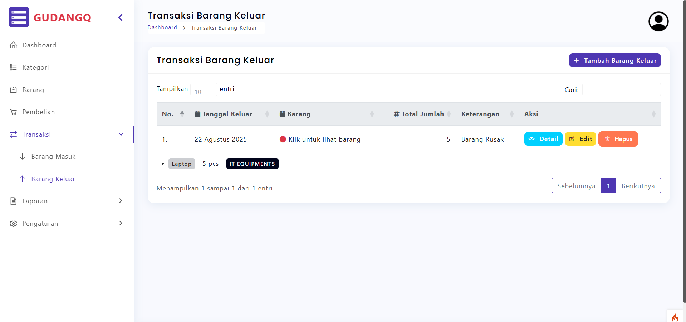

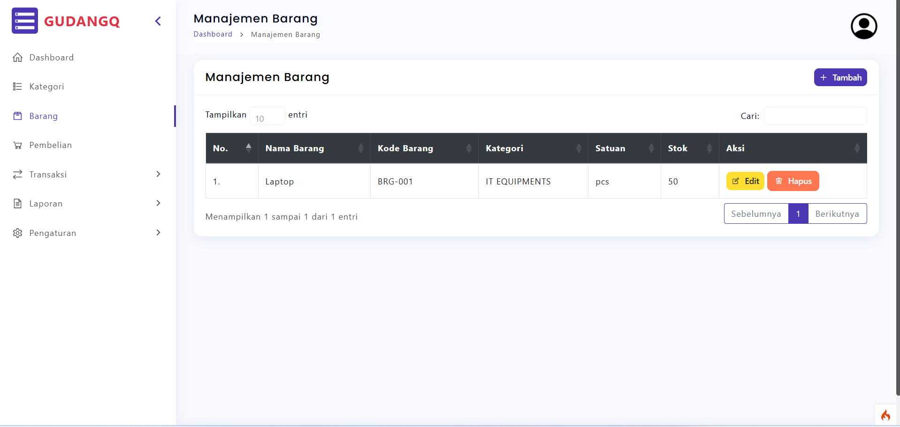

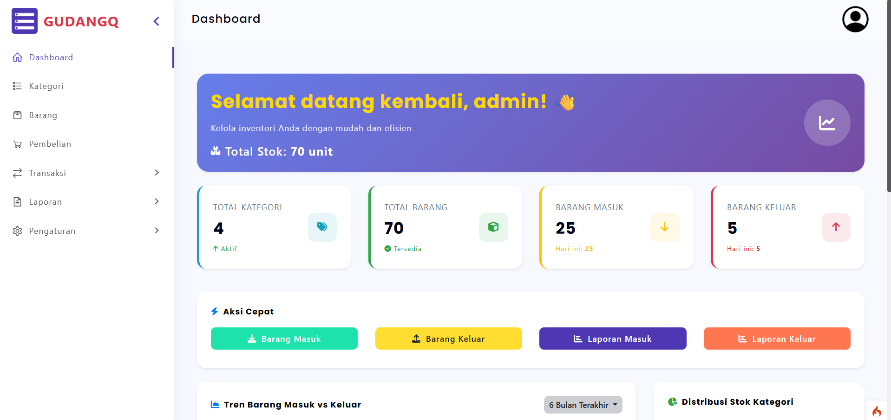

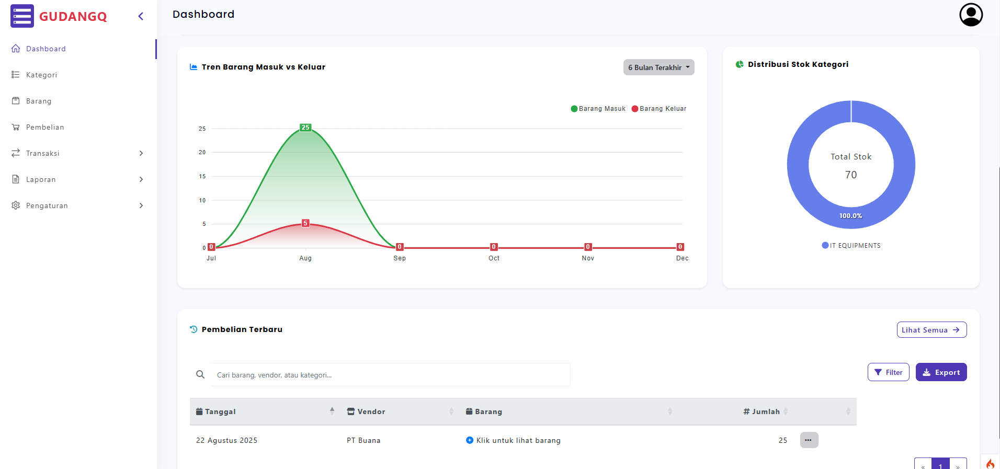

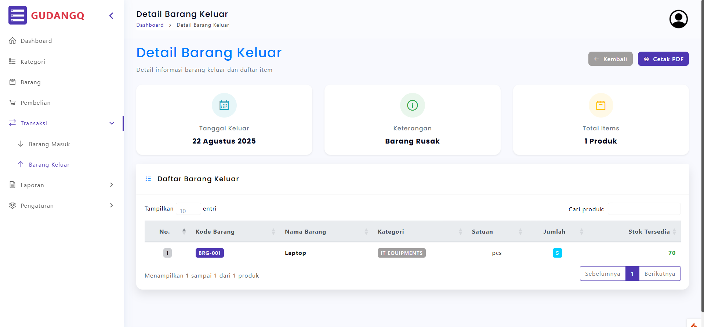

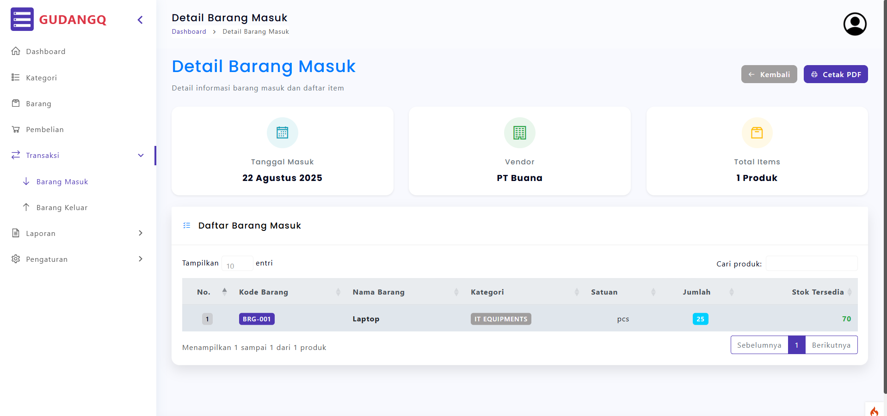

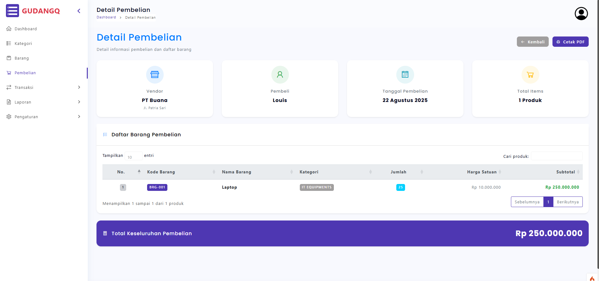

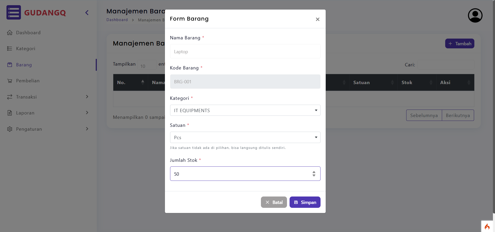

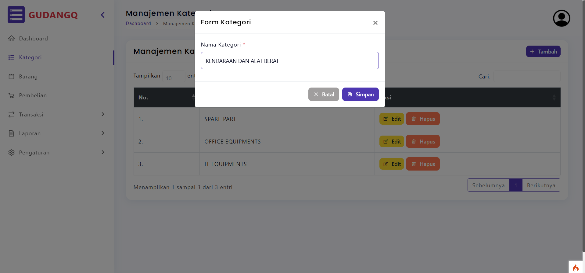

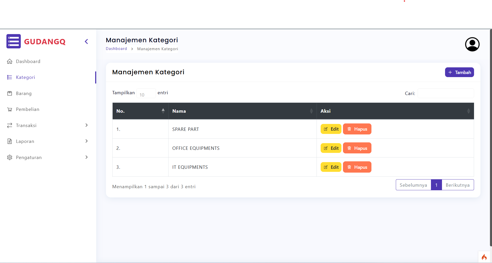

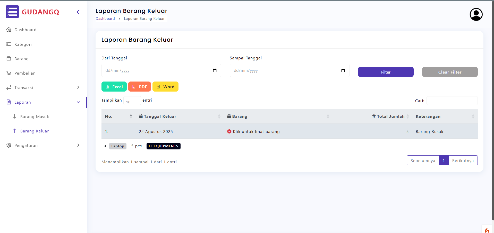

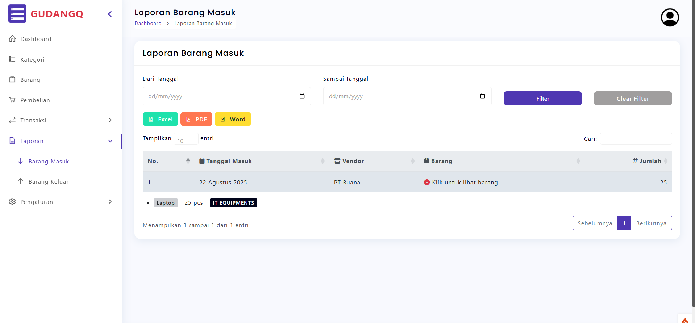

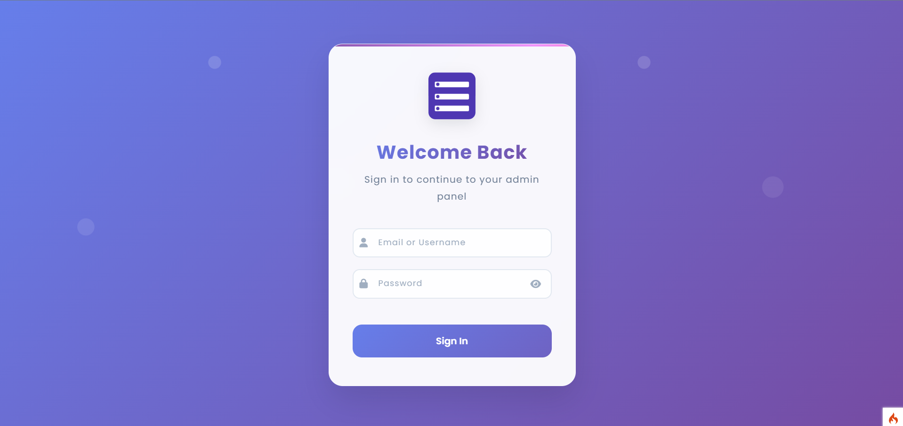

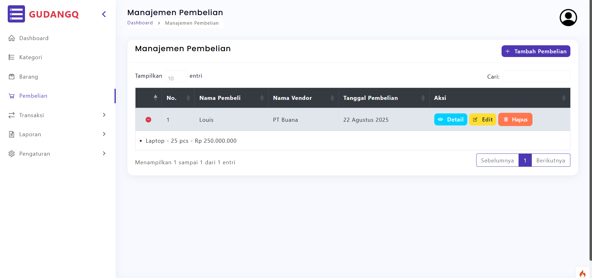

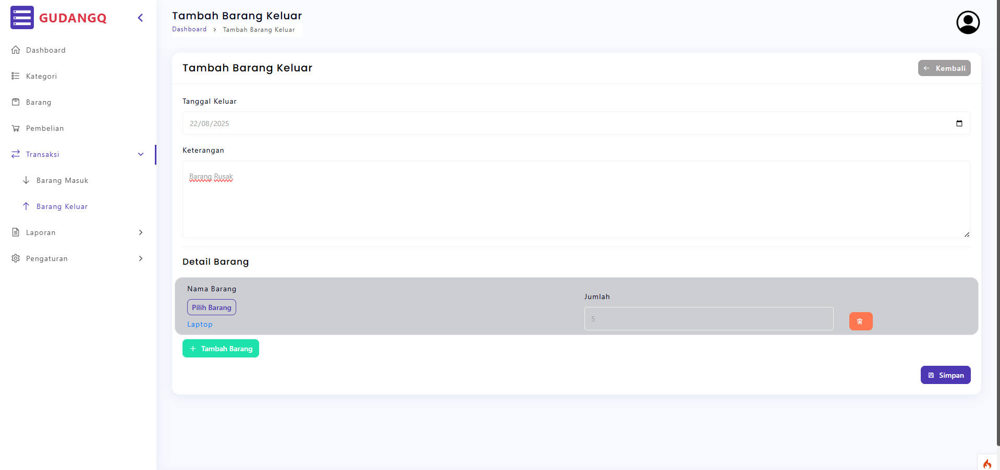

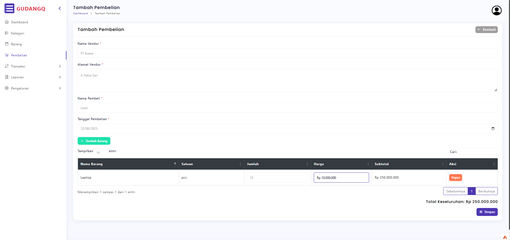

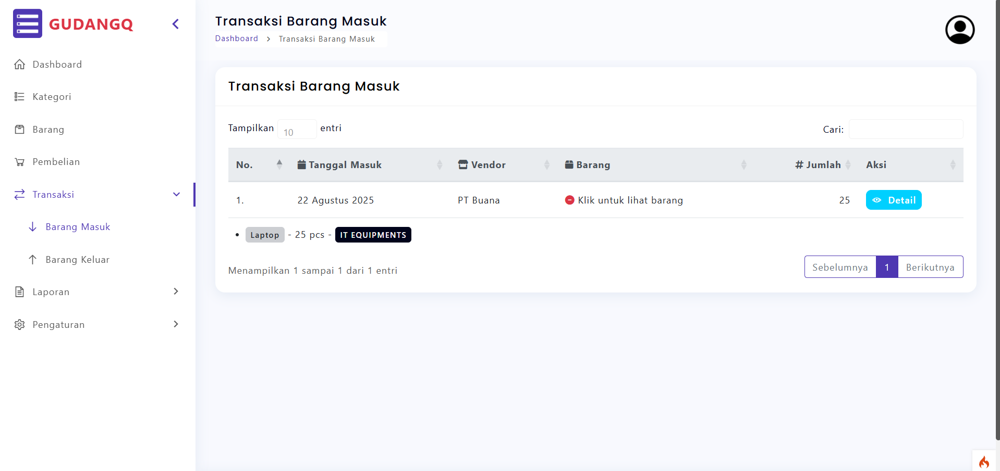
